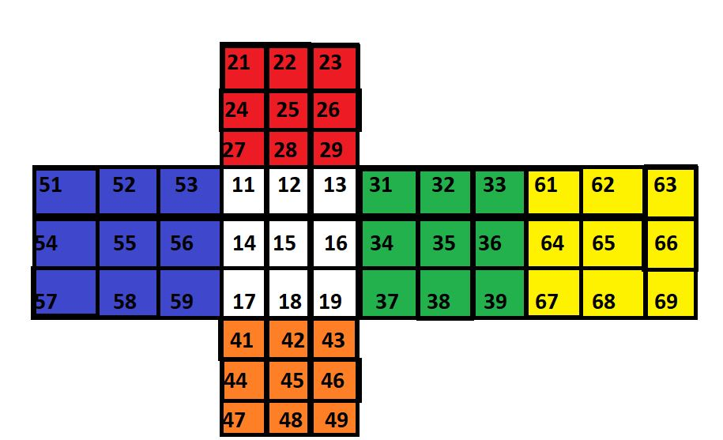

# cube-solving-basic-algo
Project made for [Robotics](https://www.facebook.com/robo.soc.nith/) club of [NIT-H](http://nith.ac.in/)

##### Language: [C](https://en.wikipedia.org/wiki/C_(programming_language))

The basic [overview](https://rubiks-cube-solver.com/how-to-solve/) of steps involved in a solution of a rubik's cube

Download the library to be used : [Link 1](https://drive.google.com/open?id=1b1SzeZQT7itGW3T_t19YB4TKQdkxNb3P)

**To link this library to your code use these steps : *watch from `1:41`* [Youtube](https://www.youtube.com/watch?v=-3BoOuSSCeI)**

## Here is the basic layout of the cube
We can see that every step is in form of rotation of one of six faces in either clockwise or anti-clockwise direction relative to the face and we have defined functions for the same




## Basic overview of functioning of library

We are imagining the cube as a `6x3x3 matrix` which hold values according to the above layout

## Using the library functions

First we need to create a `6x3x3 matrix` like this :

`int cube[6][3][3]= {{{11, 12, 13}, {14, 15, 16}, {17, 18, 19}}, {{21, 22, 23}, {24, 25, 26}, {27, 28, 29}}, {{31, 32, 33}, {34, 35, 36}, {37, 38, 39}}, {{41, 42, 43}, {44, 45, 46}, {47, 48, 49}}, {{51, 52, 53}, {54, 55, 56}, {57, 58, 59}}, {{61, 62, 63}, {64, 65, 66}, {67, 68, 69}}};`

We can(should) change the values depending on how we have scrambled the cube

**To rotate one face clockwise we use the following statement : `face1(&cube[0][0][0], 0)`**
// this rotates the face1 clockwise ie. the white face

## List of functions

|function name|work|
|----------|---------|
|`face1(int *a, int b)` | rotates white face|
|`face2(int *a, int b)` | rotates red face|
|`face3(int *a, int b)` | rotates green face|
|`face4(int *a, int b)` | rotates orange face|
|`face5(int *a, int b)` | rotates blue face|
|`face6(int *a, int b)` | rotates yellow face|

First parameter tells the address first element of the face

Second tells if rotation is *clockwise* or *anti-clockwise*

```
0 for clockwise

1 for anti-clockwise
```
